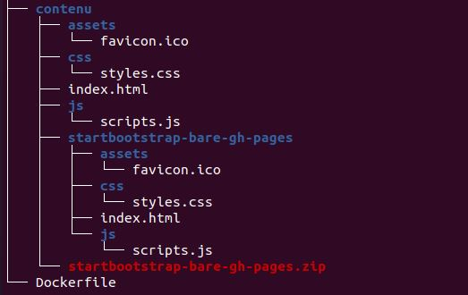
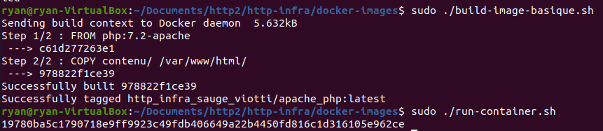
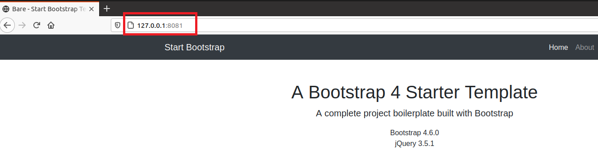
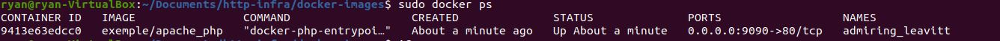
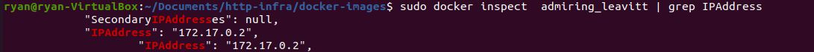
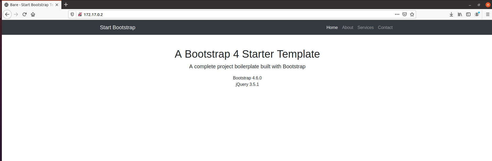
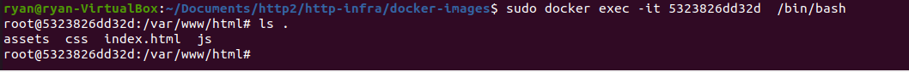
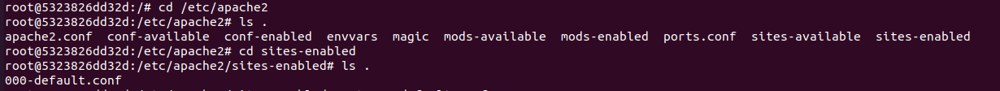

---
### Webcasts

- [Labo HTTP (1): Serveur apache httpd "dockerisé" servant du contenu statique](https://www.youtube.com/watch?v=XFO4OmcfI3U)

### Acceptance criteria

- You have a GitHub repo with everything needed to build the Docker image.
- You can do a demo, where you build the image, run a container and access content from a browser.
- You have used a nice looking web template, different from the one shown in the webcast.
- You are able to explain what you do in the Dockerfile.
- You are able to show where the apache config files are located (in a running container).
- You have **documented** your configuration in your report.
---


# Lancer un serveur httpd dans Docker

Cet article présente la création d'un dockerfile permettant de construire un conteneur exécutant un serveur httpd.

## Arborescence

- les scripts Docker et le Dockerfile se trouvent dans le dossier docker-images
- Le Contenu du site, qui sera à copier dans le dossier /var/ww/html/ dans le Dockerfile se trouve dans le dossier contenu. Il contient également le template boostrap




## 1) Bootstrap

On télécharge et on met les fichiers du template bootstrap dans le dossier contenu.

Les fichiers peuvent être téléchargés au lien suivant : 

https://startbootstrap.com/template/bare


## 2) Contenu du Dockerfile

Contenu du Dockerfile

```
FROM php:7.2-apache
COPY contenu/ /var/www/html/
```

La directive COPY va copier le dossier contenu dans le dossier /var/www/html/ du conteneur.

##  3) Lancement conteneur(build, run, etc.)

Les fichiers nécessaires se trouvent dans *docker-images*

1) Construire le conteneur à partir de l'image

Pour ce faire vous pouvez lancer le script *build-image-basique.sh*

Celui-ci effectue la commande suivante :

```
docker build --tag http_infra_sauge_viotti/apache_php .
```

2) Lancer le conteneur en arrière plan.

Pour cela il suffit de lancer le script *run-container.sh*

Port mapping : le port 80  du conteneur sur lequel écoute le serveur sera redirigé sur le port 8081 de la machine hôte (localhost)

```
docker run -d -p 8081:80 http_infra_sauge_viotti/apache_php

```


**Exemple :**




## Vérification

Vous pouvez ensuite accéder au serveur web en localhost sur le port 8081



### Accéder au serveur avec l'ip du conteneur

Il est aussi possible d'accéder au site web directement avec l'ip du conteneur

a) Obtenir le nom de l'image :

```bash
docker ps
```



b) Obtenir l'IP du conteneur

```
docker inspect <nom conteneur ou id> | grep IPAddress
```



L'ip permet d'accéder au serveur httpd depuis la machine hôte grâce à un navigateur.

c) Vérifier le résultat

## Apache arborescence

Vous pouvez obtenir un shell sur le conteneur en arrière plan avec la commande suivante :

```
docker exec -it <nom conteneur> /bin/bash
```

Le contenu du site se trouve dans */var/www/html*



Les fichiers de configuration se trouvent dans */etc/apache2*

