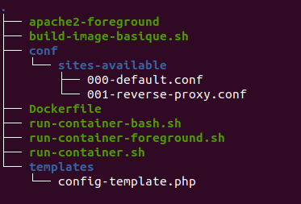
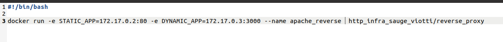
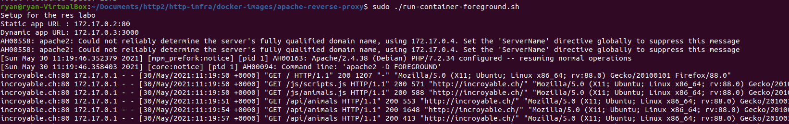
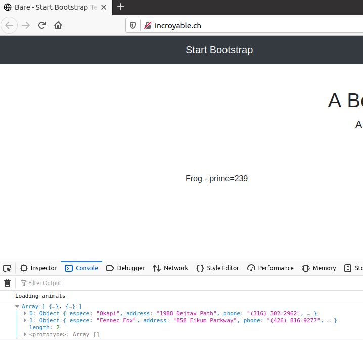
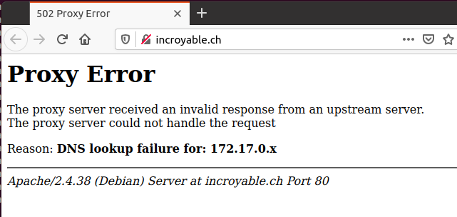

---
​---

You have a GitHub repo with everything needed to build the various images.

You have found a way to replace the static configuration of the reverse proxy (hard-coded IP adresses) with a dynamic configuration.

You may use the approach presented in the webcast (environment variables and PHP script executed when the reverse proxy container is started), or you may use another approach. The requirement is that you should not have to rebuild the reverse proxy Docker image when the IP addresses of the servers change.

You are able to do an end-to-end demo with a well-prepared scenario. Make sure that 

you can demonstrate that everything works fine when the IP addresses change!

You are able to explain how you have implemented the solution and walk us through the configuration and the code.

You have documented your configuration in your report.
​---
---


# README

## Arborescence

La configuration du reverse proxy se trouve dans docker-images/apache-reverse-proxy.



## **DockerFile**

Cette partie indique, dans l'ordre, ce que fait le dockerfile

1) Le dockerfile copie apache2_foreground dans le usr/local/bin

## **apache2_foreground**
Script exécuté au démarrage du container. Il permet l'utilisation de variables d'environnement.

- Le début du script permet d'afficher les adresses IP, si le container n'est pas lancé en arrière plan.
- La commande php permet de copier le fichier de configuration config-template.php dans /etc/apache2/sites-available

Le reste du script reste inchangée et provient de l'image apache 7.2 utilisée pour le labo

```bash
#!/bin/bash
set -e

echo "Setup for the res labo"
echo "Static app URL : $STATIC_APP"
echo "Dynamic app URL: $DYNAMIC_APP"

php /var/apache2/templates/config-template.php > /etc/apache2/sites-available/001-reverse-proxy.conf

```

## **Template du reverse proxy**
Utilisation de code php afin d'avoir accès à des variables d'environnement. Ces variables permettent de ne PAS avoir à coder les ProxyPass en dur dans le fichier config, mais bien de les spécifier au démarrage du container comme présenté en-dessous.
```
<?php

$STATIC_APP = getenv('STATIC_APP');
$DYNAMIC_APP = getenv('DYNAMIC_APP');
?>

<VirtualHost *:80>
	ServerName incroyable.ch
	
	ProxyPass '/api/animals' 'http://<?php print "$DYNAMIC_APP"?>/'
	ProxyPassReverse '/api/animals' 'http://<?php print "$DYNAMIC_APP"?>/'
	
	ProxyPass '/' 'http://<?php print "$STATIC_APP"?>/'
	ProxyPassReverse '/' '<?php print "$STATIC_APP"?>/'
</VirtualHost>

```

## **Utilisation**
1) Lancer les container des images apache_php et express_dynamic et récupérer leurs IP respectives. (Les méthodes sont explicitées dans les premières parties du labo.)
2) Lancer la commande suivante ```docker run -d -e STATIC_APP=172.17.0.x:80 -e DYNAMIC_APP=172.17.0.y:3000 --name apache_reverse -p 8080:80 http_infra_sauge_viotti/reverse_proxy```
3) STATIC_APP doit contenir l'IP du container apache_php et DYNAMIC_APP doit contenir celle du express_dynamic
4) Accédez au site et vous devriez voir apparaître "espece : prime=XXX". Cela indique que le contenu dynamique fonctionne.

## Exemples








### Mauvaise configuration des IP



## Sources annexes:

https://httpd.apache.org/docs/2.4/fr/mod/mod_proxy_http.html
