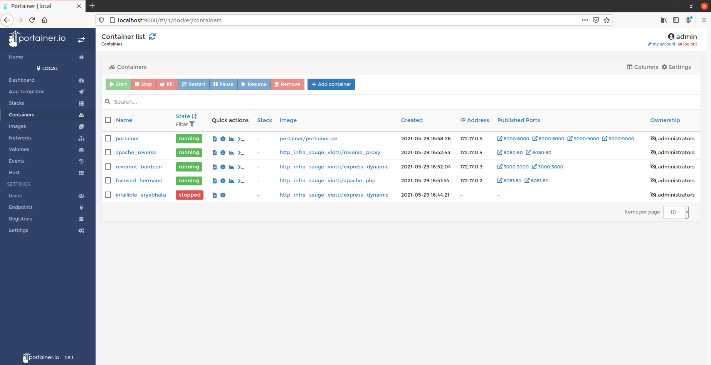

# README

## **Management UI**
Afin de mettre en place un management UI, nous avons décidé d'utiliser Portainer. (https://www.portainer.io/)

## **Utilisation**
Pour cela, rien de plus simple, effectuez les commandes suivantes
```
docker volume create portainer_data
docker run -d -p 8000:8000 -p 9000:9000 --name=portainer --restart=always -v /var/run/docker.sock:/var/run/docker.sock -v portainer_data:/data portainer/portainer-ce
```

Cela va créer un volume pour Portainer et vous permettre de vous connecter à l'UI sur les ports désignés. (ex: localhost:9000)
Vous devriez voir apparaître une interface comme ceci :


## **Sources
https://documentation.portainer.io/v2.0/deploy/ceinstalldocker/
