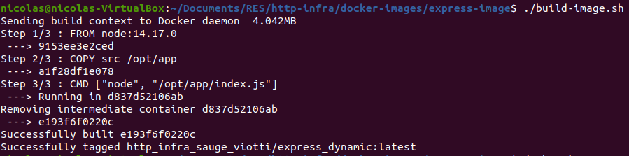
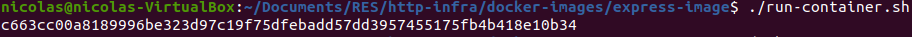
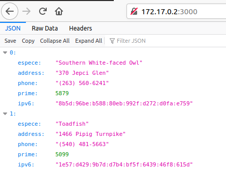
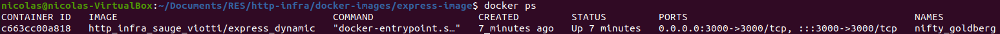
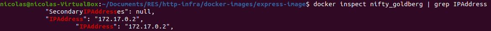

# README

## Description

Nous avons été mandaté par une agence de renseignement afin de créer un serveur node js qui renvoie une liste d'agents secrets.

-L'espèce dont il fait partie

-Une adresse correspondant à son lieu d'opération

-Un prime number afin de pouvoir l'identifier. Un agent portant un nombre de Carmichael est un agent-double.

-Un numéro de téléphone afin de pouvoir être contacté

-Une adresse IP pour surfer sur internet

Pour répondre aux besoins du clients, nous avons utilisés le package chance.

https://github.com/chancejs/chancejs/blob/master/docs/thing/animal.md

## Lancement du serveur
Afin de lancer le serveur, exécutez le script build-image.sh
[]
Puis run le container avec le script run-container.sh. Le container sera exécuté en arrière plan. Si vous souhaitez voir la payload dans le terminal, éditer le fichier et retire l'option -d de la commande run.
[]

Ensuite, se rendre sur un navigateur et entrer l'adresse ip du docker avec le port 3000 afin de recevoir une liste d'animaux sous format json
[]

Afin de lancer le serveur, il faut tout d'abord build l'image dockerà partir du Dockerfile fourni dans http-infra/docker-images/express-image avec la commande suivante :
//INSERER SCREENSHOT
Puis ensuite l'exécuter avec la commande docker run :
//INSERER SCREENSHOT
Si le processus s'est déroulé correctement, vous devriez avoir un message d'accueil ressemblant à ceci :
//INSERER SCREEN
Il ne reste plus qu'à accéder au site depuis votre navigateur en précisant ip:3000

Afin de connaitre le nom du container :
[]

Afin de connaitre l'adresse IP du container :
[]

## Exemple
