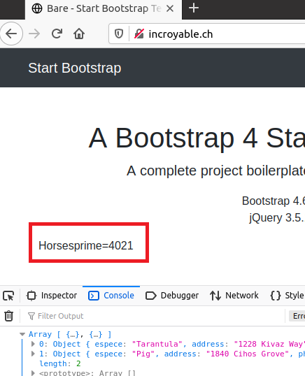

---
You have a GitHub repo with everything needed to build the various images.
You can do a complete, end-to-end demonstration: the web page is dynamically updated every few seconds (with the data coming from the dynamic backend).
You are able to prove that AJAX requests are sent by the browser and you can show the content of th responses.
You are able to explain why your demo would not work without a reverse proxy (because of a security restriction).
You have documented your configuration in your report.
---


# README

## **DockerFile**

Cette partie indique, dans l'ordre, ce que fait le dockerfile

1) Le dockerfile des différents images Apache met à jour le système et installe "vim"

## **Modification du site**
1) Modification de l'index du site statique afin d'ajouter un script custom "student.js"
2) Le script student.js est exécuté au chargement de la page web. Il contient une fonction loadAnimals() qui exécute une fonction faisant une requête sur l'api afin de recevoir du json contenant les Animals (voir partie précédente). Toutes les deux secondes, on remplace le texte de la class CSS "animals" par un nouvel Animal (espèce et numéro d'agent) provenant du json.
```
$(function(){
console.log("Loading animals");

function loadAnimals(){
        $.getJSON("/api/animals", function(animals){
                console.log(animals);
                var message = "Nobody is here";
                if (animals.length > 0){
                        message =  animals[0].espece +  "prime=" + animals[0].$
                }
                $(".animals").text(message);

                });
        };
loadAnimals();
setInterval(loadAnimals, 3000);

});
```


4) Ainsi, sur la page principale du site statique, on peut voir un nouvel Animal toutes les deux secondes sous la bannière principale

## Exemples




## Sources annexes:

https://api.jquery.com/jquery.getjson/
https://learn.jquery.com/using-jquery-core/selecting-elements/
