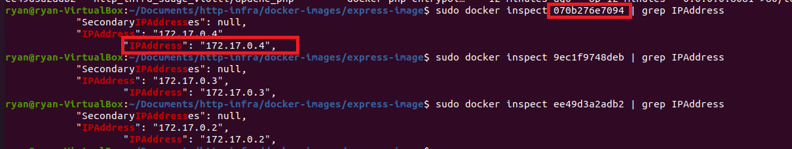

---
You have a GitHub repo with everything needed to build the Docker image for the container.
You can do a demo, where you start from an "empty" Docker environment (no container running) and where you start 3 containers: static server, dynamic server and reverse proxy; in the demo, you prove that the routing is done correctly by the reverse proxy.
You can explain and prove that the static and dynamic servers cannot be reached directly (reverse proxy is a single entry point in the infra).
You are able to explain why the static configuration is fragile and needs to be improved.
You have documented your configuration in your report.
---

# README

## **DockerFile**

Cette partie indique, dans l'ordre, ce que fait le dockerfile

1) Le dockerfile se base sur une image d'apache ayant également le support de php (php:7.2-apache)

2) Copie le contenu situé dans *conf* dans le dossier */etc/apache2* du conteneur

3) Active avec a2enmode les modules : *proxy* et *proxy_http*

- proxy fournit une passerelle pour le serveur HTTP Apache
- proxy_http fournit le support pour  des requêtes HTTP et HTTPS.

4) Active les sites 0001-* et 001-*

Le site est accessible à l'adresse suivante : incroyable.ch


## DNS

Pour que la résolution du nom de domaine fonctionne, il faut ajouter l'ip du conteneur faisant tourner le reverse proxy avec le nom de domaine correspondant.


Pour récupérer l'adresse IP de votre reverse proxy, vous pouvez effectuer :

```
docker ps
docker inspect <id conteneur ou nom> | grep IPAddress>
```





## Exemple


## Sources annexes:

https://httpd.apache.org/docs/2.4/fr/mod/mod_proxy_http.html