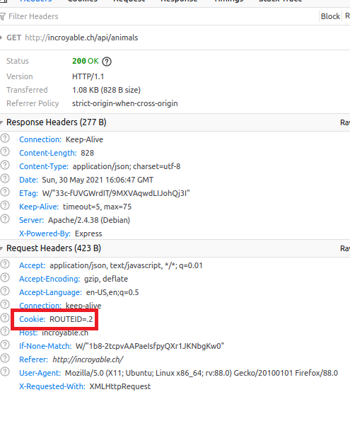

---

You do a setup to demonstrate the notion of sticky session.
You prove that your load balancer can distribute HTTP requests in a round-robin fashion to the dynamic server nodes (because there is no state).
You prove that your load balancer can handle sticky sessions when forwarding HTTP requests to the static server nodes.
You have documented your configuration and your validation procedure in your report.
---


# README


## Introduction

Les sticky session permettent d'assigner un serveur particulier à un client lors de sa 1ère requête.

C'est utile si on souhaite ne pas repartir de zéro à chaque requête du client, par exemple dans le cas d'un panier d'achat ou d'une authentification.


### Configuration

Dans le fichier apache-reverse-proxy/templates/config-template.php

Cette ligne ajoute la route id dans le header, ce qui va permettre dans les requêtes suivantes de savoir à quelle route appartient le client.

```bash
Header add Set-Cookie "ROUTEID=.%{BALANCER_WORKER_ROUTE}e; path=/" env=BALANCER_ROUTE_CHANGED
```


Pour définir quelle ip est sur quelle route, on ajoute l'attribut route

```bash
	
		BalancerMember 'http://<?php print "$STATIC_APP_1"?>' route=1

		BalancerMember 'http://<?php print "$STATIC_APP_2"?>' route=2
```

La directive ProxySet va affecter la valeur de ROUTEID à la variable stickysession


```
	ProxySet stickysession=ROUTEID
```


## Validation

Sur le manager, on peut constater qu'il y a bien le paramètre ROUTEID dans la zone dédiée à la sticky session


Dans le navigateur, avec la console, on peut observer un cookie avec la route id correspondante.




## Sources :

[https://dev.to/gkoniaris/why-you-should-never-use-sticky-sessions-2pkj](https://dev.to/gkoniaris/why-you-should-never-use-sticky-sessions-2pkj)

https://httpd.apache.org/docs/2.4/fr/mod/mod_proxy_balancer.html