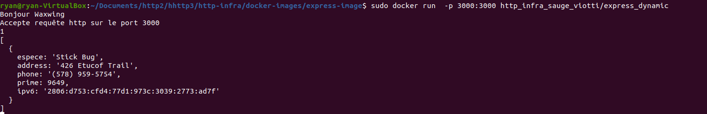

---
You have a GitHub repo with everything needed to build the Docker image.
You can do a demo, where you build the image, run a container and access content from a browser.
You generate dynamic, random content and return a JSON payload to the client.
You cannot return the same content as the webcast (you cannot return a list of people).
You don't have to use express.js; if you want, you can use another JavaScript web framework or event another language.
You have documented your configuration in your report.
---

# README

## Description

Nous avons été mandaté par une agence de renseignement afin de créer un serveur node js qui renvoie une liste d'agents secrets.

-L'espèce dont il fait partie

-Une adresse correspondant à son lieu d'opération

-Un prime number afin de pouvoir l'identifier. Un agent portant un nombre de Carmichael est un agent-double.

-Un numéro de téléphone afin de pouvoir être contacté

-Une adresse IP pour surfer sur internet

Pour répondre aux besoins du clients, nous avons utilisés le package chance.

Lien : [https://github.com/chancejs/chancejs/blob/master/docs/thing/animal.md](https://github.com/chancejs/chancejs/blob/master/docs/thing/animal.md)

## Arborescence


Le fichier package.json se trouve dans le dossier src.

# Configuration

### Installation des nodes_modules

Les nodes modules se trouvent déjà dans le git.

Il est cependant possible de les mettre à jour ou des les réinstaller en lançant la commande suivante dans le dossier express-image/src

Les dépendances se trouvent dans le fichier package.json.

```bash
npm install
```

### Index.js

Lorsqu'une requête get est effectué au serveur sur la ressource /, le serveur va exécuter une requête renvoyant un tableau d'animaux.

```
app.get('/', function(req, res){
	res.send(generateAnimalsIncredible());
});

```


### Lancement du serveur

Afin de lancer le serveur, exécutez le script build-image.sh


Puis lancer le script run-container.sh qui exécutera le container en arrière plan. 


Si vous souhaitez voir la payload dans le terminal, éditer le fichier et retire l'option -d de la commande run ou lancer la commande suivante :

```bash
docker run -p 3000:3000 http_infra_sauge_viotti/express_dynamic
```

Sur les 2 images ci-dessous, on peut voir que la requête fait par le client est affiché sur la console d'affichage du serveur




## Accéder au serveur

### Port mapping

Une fois le conteneur en exécution, le serveur est ensuite accessible en localhost sur le port 3000 grâce au port mapping.


### Avec l'ip du conteneur

Afin de connaitre le nom du container :


Afin de connaitre l'adresse IP du container :


Ensuite, se rendre sur un navigateur et entrer l'adresse ip du docker avec le port 3000 afin de recevoir une liste d'animaux sous format json.


