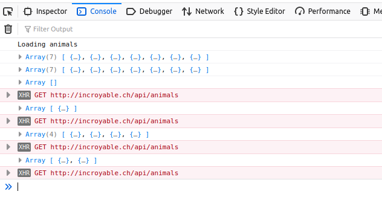

---
You extend the reverse proxy configuration to support load balancing.
You show that you can have multiple static server nodes and multiple dynamic server nodes.
You prove that the load balancer can distribute HTTP requests between these nodes.
You have documented your configuration and your validation procedure in your report.

---

# README

## **DockerFile**

Cette partie indique, dans l'ordre, ce que fait le dockerfile

1) Le dockerfile se base sur une image d'apache ayant également le support de php (php:7.2-apache)

2) Copie le contenu situé dans *conf* dans le dossier */etc/apache2* du conteneur

3) Active avec a2enmode les modules : *proxy* et *proxy_http*

- proxy fournit une passerelle pour le serveur HTTP Apache
- proxy_http fournit le support pour  des requêtes HTTP et HTTPS.

4) Active les sites 0001-* et 001-*

## Proxy

Le fichier de configuration est config-template.php

Il y a 2 proxy balancers : un pour le serveur static et l'autre pour le dynamique.

Chaque de ces load balancers contient 2 membres correspondant aux IP des conteneurs sur lesquels tournent un serveur.

L'algorithme utilisé pour la répartition des charges est celui-par défaut : byrequests

Celui-ci va répartir les requêtes en fonction du nombre de requête traitées.

La directive ProxyPassReverse va obliger la réécriture des en-tête afin de conserver anonyme les serveurs tournant en arrière plan.

La directive proxyPass associe une adresse au groupe de balancer correspondant

## Preuve

Pour prouver que les requêtes sont bien répartis entre les serveurs, nous allons renseigner une mauvaise adresse ip pour la variable DYNAMIC_APP_2

Ensuite, lorsqu'on ouvre la console du navigateur, on peut remarquer qu'une requête sur deux n'aboutit pas.

Dans les logs du reverse proxy, on peut voir une erreur de proxy avec l'adresse IP incorrect

## Sources annexes:

- https://httpd.apache.org/docs/2.4/fr/mod/mod_proxy_http.html

Directive proxy pass

- https://httpd.apache.org/docs/2.4/mod/mod_proxy.html#proxypass

Article complet sur apache :

- https://fr.slideshare.net/RachidNIDSAID/apache-http

